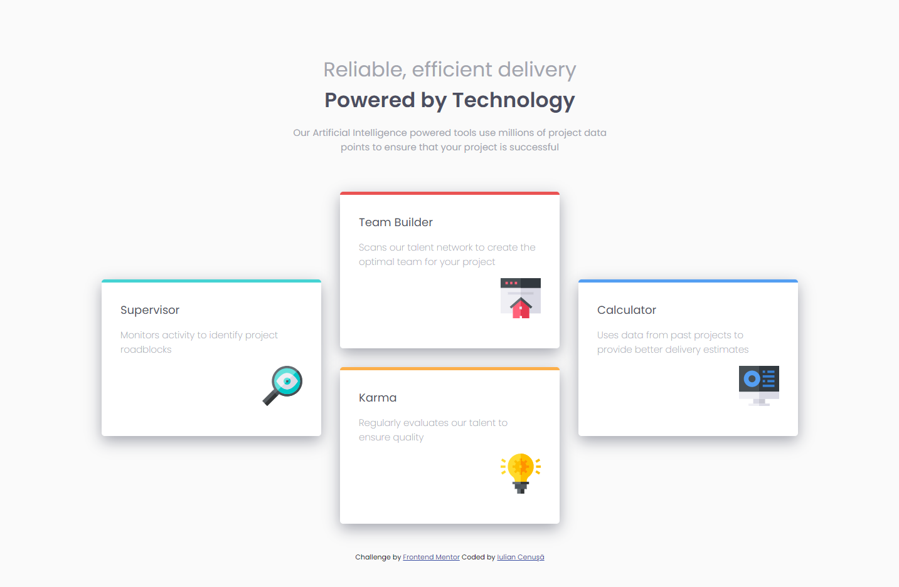

# Frontend Mentor - Four card feature section solution

This is a solution to the [Four card feature section challenge on Frontend Mentor](https://www.frontendmentor.io/challenges/four-card-feature-section-weK1eFYK). Frontend Mentor challenges help you improve your coding skills by building realistic projects. 

## Table of contents

- [Overview](#overview)
  - [The challenge](#the-challenge)
  - [Screenshot](#screenshot)
  - [Links](#links)
- [My process](#my-process)
  - [Built with](#built-with)
  - [What I learned](#what-i-learned)
  - [Continued development](#continued-development)
  - [Useful resources](#useful-resources)
- [Author](#author)

## Overview

### The challenge

Users should be able to:

- View the optimal layout for the site depending on their device's screen size

### Screenshot

### Links

- Solution URL: [GitHub](https://github.com/iulian-cenusa/frontend-mentor-four-card-feature-section)
- Live Site URL: [GitHub Pages](hhttps://github.com/iulian-cenusa/frontend-mentor-four-card-feature-section)

## My process

### Built with

- Semantic HTML5 markup
- CSS custom properties
- Flexbox
- CSS Grid
- Mobile-first workflow

### What I learned

In this project I consolidated CSS grid and CSS flexbox knoledge and learn about box shadows and content positioning.

### Continued development

As with every project this is not complete. It can be improved to look exactly like the design files.

### Useful resources

- [CSS Box Shadow](https://www.w3schools.com/css/css3_shadows_box.asp) - This helped me with box shadows.
- [91 Beautiful CSS box-shadow examples - CSS Scan](https://getcssscan.com/css-box-shadow-examples) - This helpem me with the box shadow style.

## Author

- Frontend Mentor - [@iulian-cenusa](https://www.frontendmentor.io/profile/iulian-cenusa)
- Twitter - [@IulianCenusa](https://twitter.com/IulianCenusa)
- Other Projects - [Bitbucket Repo](https://bitbucket.org/iulian_cenusa/)

